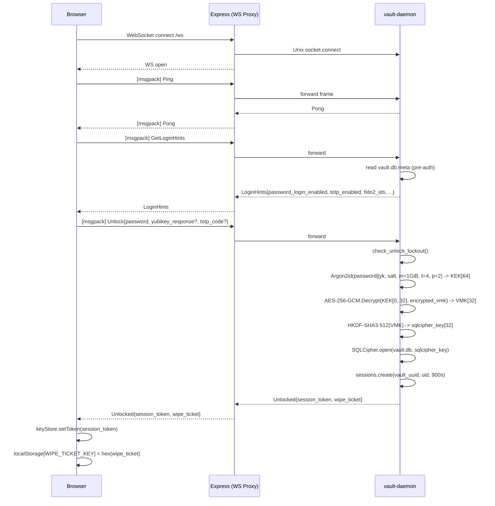
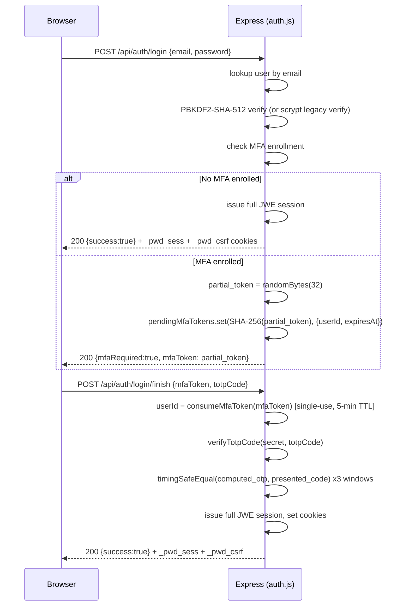
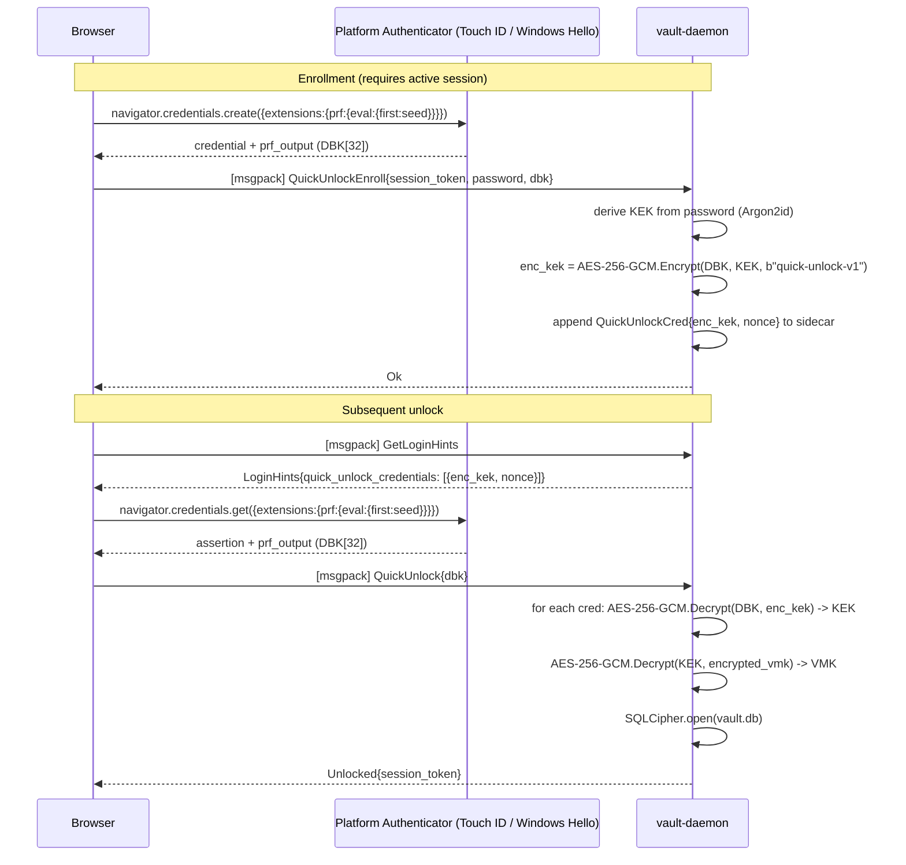
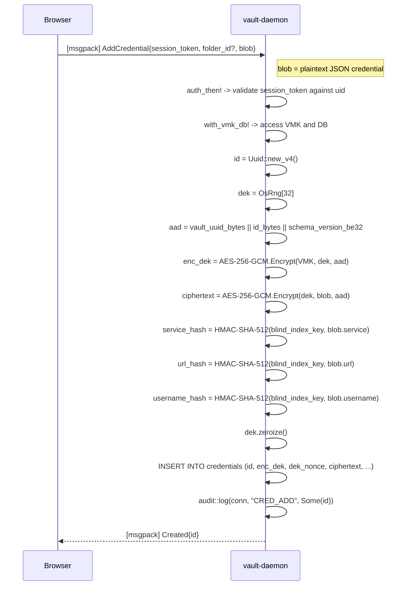
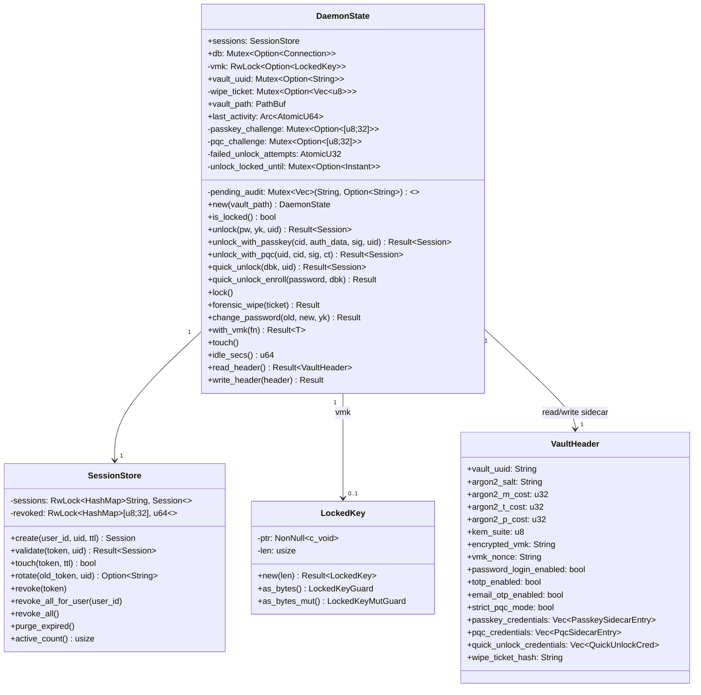

<!-- PWDnow Technical Reference — Rendered best in any Markdown viewer with CSS support -->

<div style="page-break-after: always; text-align: center; padding-top: 200px;">

# PWDnow

## Complete Technical Reference

### Architecture, Cryptography, Data Formats, and Standards Compliance

---

**Classification:** Internal Technical Documentation

**Revision:** 1.0.0

**Date:** May 10, 2026

**Project:** PWDnow Password Manager

**Repository:** `PWDnow/`

---

Standards addressed in this document:

NIST SP 800-63B-4 (2024) | NIST SP 800-132 (2010) | NIST FIPS 140-3 | NIST FIPS 197
NIST FIPS 202 | NIST FIPS 203 (ML-KEM) | NIST FIPS 204 (ML-DSA)
NSA CNSA 2.0 | FIDO2 / WebAuthn (W3C) | RFC 8446 (TLS 1.3)
RFC 6238 (TOTP) | RFC 4226 (HOTP) | OWASP ASVS 5.0 (2024)

</div>

---

## Table of Contents

| Section | Title | Page |
|---------|-------|------|
| 1 | System Overview | 3 |
| 2 | Repository Layout and Build System | 4 |
| 3 | Two-Layer Architecture | 5 |
| 4 | Cryptographic Primitives Reference | 7 |
| 5 | Key Hierarchy and Derivation Chain | 11 |
| 6 | Layer 1: Vault Daemon (Rust) | 15 |
| 7 | IPC Protocol Specification | 22 |
| 8 | Database Schema Reference | 27 |
| 9 | Layer 2: Web Layer | 32 |
| 10 | Authentication Flows — UML Sequence Diagrams | 39 |
| 11 | The P2W Encrypted File Storage System | 46 |
| 12 | Security Modes | 51 |
| 13 | Offline HIBP Breach Detection | 54 |
| 14 | Vault Sync Architecture | 56 |
| 15 | Deployment Architecture | 58 |
| 16 | UML Component and Class Diagrams | 61 |
| 17 | Standards Compliance Matrix | 67 |
| 18 | Threat Model and Mitigations | 70 |

---

## 1. System Overview

<div style="text-align: right"><em>Page 3</em></div>

PWDnow is a zero-knowledge, local-first password manager designed to operate at NIST Security Level 5 with full CNSA 2.0 compliance. It is composed of two independent codebases that cooperate strictly through a documented, authenticated IPC boundary. No key material ever crosses from the cryptographic daemon into the web layer.

The system is designed around three core invariants:

**Invariant 1 — Cryptographic Confinement.** All key derivation, encryption, and decryption operations occur exclusively within the Rust daemon process. The web layer (browser and Express server) receives only opaque ciphertexts and session tokens. It never receives, stores, or derives any variant of the Key Encryption Key (KEK), Vault Master Key (VMK), or per-credential Data Encryption Key (DEK).

**Invariant 2 — Defense in Depth.** Data is encrypted at three independent layers before reaching persistent storage: the credential blob is encrypted under a per-item DEK, the DEK is encrypted under the VMK, and the VMK is encrypted under the KEK derived from the master password. A SQLCipher-layer AES-256-CBC page encryption provides a fourth envelope around the entire database file.

**Invariant 3 — Post-Quantum Readiness.** The system can operate in two modes: a classical hybrid mode using X25519 + HKDF-SHA-256, and a CNSA 2.0 mode using X448 + ML-KEM-1024 + HKDF-SHA-384 for key encapsulation, ML-DSA-87 for signatures, and AES-256-GCM as the sole symmetric cipher. In CNSA strict mode, SHA-3, BLAKE3, XChaCha20-Poly1305, Ed25519, and X25519 are all removed from active code paths.

---

## 2. Repository Layout and Build System

<div style="text-align: right"><em>Page 4</em></div>

```
PWDnow/
├── daemon/                  Rust binary (vault-daemon) — Layer 1
│   ├── src/
│   │   ├── main.rs          Tokio runtime, Unix socket listener, idle watchdog
│   │   ├── error.rs         VaultError enum (thiserror)
│   │   ├── auth/            Session management, FIDO2, TOTP, PQC authenticator
│   │   ├── crypto/          AES-GCM, XChaCha20, KDF, KEM, blind indexing, HIBP
│   │   ├── ipc/             Protocol types (msgpack), socket dispatcher
│   │   ├── sync/            Cloudflare R2 encrypted vault sync
│   │   └── vault/           SQLCipher DB, credentials, folders, assets, audit
│   ├── migrations/          SQL migration files (v1_initial, v2_defense_in_depth, v3_pqc_auth)
│   └── Cargo.toml           Feature flags: pq-hybrid-1024, cnsa-strict, mock-fido2
│
├── web/                     React 19 SPA + Express server — Layer 2
│   ├── server.js            Express: CSP nonce injection, WebSocket proxy, setup API
│   ├── auth.js              /api/auth/* and /api/vault/* routes, JWE sessions, scrypt
│   ├── src/
│   │   ├── main.tsx         React root, Trusted Types policy, context providers
│   │   ├── router.tsx       All routes, AuthedLayout guard
│   │   ├── types.ts         Core TypeScript types
│   │   ├── crypto/          SecureKeyStore (mlock analog for JS private fields)
│   │   ├── utils/           daemonClient, localCrypto, mfa, securityModes, importExport
│   │   ├── context/         VaultContext, UserContext, NotificationContext
│   │   ├── pages/           Login, Register, Vault, Settings, BreachMonitor, Setup
│   │   └── components/      Header, Sidebar, ErrorBoundary, modals
│   ├── auth_data/           Per-installation encrypted file store (P2W filesystem)
│   │   ├── .master_key      32-byte CSPRNG master key (mode 0400)
│   │   ├── users.enc        AES-256-GCM encrypted user registry
│   │   └── vault/<uid>/     Per-user encrypted resource files
│   └── vite.config.ts       Build config, @/ alias, sourcemaps off in prod
│
├── deploy/
│   ├── nginx/vault.conf     TLS 1.3-only reverse proxy, CNSA 2.0 key groups
│   ├── vault-daemon.service systemd unit, CAP_IPC_LOCK, MemorySwapMax=0
│   ├── apparmor.d/          MAC confinement profile
│   └── Makefile             Orchestrated build: cargo release + npm build
│
└── hibp/                    Offline HIBP Cuckoo filter builder script
```

### Build Feature Flags

| Flag | Effect |
|------|--------|
| `pq-hybrid-1024` (default) | Enables ML-KEM-1024 via the `ml-kem` crate. Activates `X448MlKem1024Kem` as the default KEM. |
| `cnsa-strict` | Implies `pq-hybrid-1024`. Forces HKDF-SHA-384, PBKDF2-SHA-512, SHA-384 audit hashing. Removes BLAKE3, SHA-3, XChaCha20-Poly1305, Ed25519, X25519 from all active paths. |
| `mock-fido2` | Replaces `libfido2` with a no-op stub for CI environments without hardware tokens. |

---

## 3. Two-Layer Architecture

<div style="text-align: right"><em>Page 5</em></div>

### 3.1 Architectural Boundary

The system enforces a hard process boundary between cryptographic operations (Layer 1, Rust) and the user interface (Layer 2, Node.js/React). This boundary is authenticated at the OS level using `SO_PEERCRED` on the Unix domain socket.

```
┌─────────────────────────────────────────────────────────────────────┐
│  Browser (Layer 2 Client)                                           │
│  React 19 SPA — zero knowledge of KEK/VMK/DEK                      │
│  SecureKeyStore: session token in JS private field only             │
└──────────────────────────┬──────────────────────────────────────────┘
                           │ WebSocket (binary, msgpack)
                           │ ws://localhost/ws
┌──────────────────────────▼──────────────────────────────────────────┐
│  Express Server (Layer 2 Server, server.js)                         │
│  WebSocket proxy: browser WS ↔ Unix socket (one-to-one mapping)    │
│  CSP nonce injection, static asset serving, setup API              │
└──────────────────────────┬──────────────────────────────────────────┘
                           │ Unix domain socket
                           │ /run/vault-daemon/vault.sock
                           │ Auth: SO_PEERCRED (UID check on every request)
┌──────────────────────────▼──────────────────────────────────────────┐
│  vault-daemon (Layer 1, Rust + Tokio)                               │
│  All crypto: Argon2id, AES-256-GCM, XChaCha20-Poly1305,            │
│              ML-KEM-1024, ML-DSA-87, HKDF, PBKDF2-SHA-512         │
│  SQLCipher database: vault.db (AES-256-CBC pages)                  │
│  VMK in mlock'd, PROT_NONE memory (LockedKey)                      │
└─────────────────────────────────────────────────────────────────────┘
```

### 3.2 Three Operating Modes

The web layer supports three distinct modes of operation. Mode detection happens in `VaultContext` by inspecting the `_pwd_csrf` cookie (JS-readable, non-HttpOnly).

| Mode | Trigger | Vault Storage | Session Credential |
|------|---------|---------------|-------------------|
| **Daemon** | `daemon.unlock()` succeeds | Rust daemon, SQLCipher | Session token in `SecureKeyStore` JS private field `#token` |
| **Server** | `POST /api/auth/login` succeeds | AES-256-GCM encrypted `.enc` files in `auth_data/vault/<uid>/` | JWE cookie `_pwd_sess` (HttpOnly) |
| **Unauthenticated** | Neither above | None | None; redirect to `/login` |

When `hasServerSession()` returns `true`, all vault reads and writes are routed to `/api/vault/*` REST endpoints instead of the daemon IPC connection. This allows the system to function on hosts where the daemon is not installed.

### 3.3 Process Supervision

The daemon runs under systemd with the following security constraints:

```ini
[Service]
User=vault
NoNewPrivileges=yes
PrivateTmp=yes
MemorySwapMax=0          # VMK pages must never reach disk
AmbientCapabilities=CAP_IPC_LOCK   # required for mlock(2)
```

AppArmor confinement limits the daemon's filesystem access to `/run/vault-daemon/`, the vault data directory, and required library paths.

---

## 4. Cryptographic Primitives Reference

<div style="text-align: right"><em>Page 7</em></div>

### 4.1 Symmetric Encryption

#### AES-256-GCM (Primary AEAD, FIPS 197 + NIST SP 800-38D)

Used for: VMK encryption under KEK, per-credential DEK encryption under VMK, credential blob encryption under DEK, Quick Unlock KEK wrapping, server-side file encryption (auth_data), PQC VMK transport.

- Key length: 256 bits
- Nonce: 96 bits (12 bytes), randomly generated per operation via `OsRng`
- Authentication tag: 128 bits (16 bytes, appended to ciphertext)
- AAD: bound to context (e.g., `b"vmk-aad-v1"`, `build_aad(vault_uuid, cred_id)`)
- Implementation: `aes-gcm` crate v0.10 (RustCrypto), constant-time

Wire encoding: ciphertext bytes include the trailing 16-byte tag. Nonce stored separately as a raw 12-byte blob in SQLite.

#### XChaCha20-Poly1305 (Secondary AEAD, RFC 8439 extended nonce)

Used for: VMK encryption in legacy vaults, per-credential DEK and blob encryption when the vault was originally created in non-CNSA mode.

- Key length: 256 bits
- Nonce: 192 bits (24 bytes), randomly generated per operation
- Authentication tag: 128 bits
- AAD: identical binding context as AES-GCM paths
- Implementation: `chacha20poly1305` crate v0.10.1

The 24-byte nonce length eliminates nonce-reuse risk from a random nonce across the entire vault lifetime. When the nonce field in SQLite is 12 bytes, the AES-GCM path is taken; when 24 bytes, XChaCha20-Poly1305 is taken. This is the only place both ciphers coexist.

In `cnsa-strict` mode, XChaCha20-Poly1305 is removed from all new write paths. Existing databases created before CNSA migration continue to read legacy 24-byte-nonce records until they are re-encrypted.

### 4.2 Key Derivation Functions

#### Argon2id (Default KDF, NIST SP 800-63B-4 (2024) §5.1.1.2, PHC winner)

Used for: KEK derivation from master password (primary path).

Parameters (production, auto-tuned by `kdf_tune.rs`):

| Parameter | Value | Note |
|-----------|-------|------|
| `m_cost` | 1,048,576 KiB (1 GiB) | Minimum for Level 5; tuner targets 1.0 s |
| `t_cost` | 4 (minimum) | Binary-searched to achieve ~1 s wall time |
| `p_cost` | 2 lanes | Parallelism |
| Output | 64 bytes | `[0..32]` = KEK, `[32..64]` = AuthKey |
| Salt | 32 bytes CSPRNG | Stored in `vault.db.meta` sidecar |
| Version | 0x13 (v1.3) | Current Argon2 specification |

YubiKey augmentation: when a YubiKey HMAC-SHA256 challenge response is provided, the 20-byte response is appended to the password bytes before KDF input, forming: `KDF_input = password_bytes || yubikey_response[20]`.

#### PBKDF2-HMAC-SHA-512 (CNSA Path, NSA CNSA 2.0 / NIST SP 800-132 (2010))

Used for: KEK derivation when `m_cost == 0` (CNSA strict activation signal); legacy server-side verification in `auth.js` (superseded by Argon2id for new hashes).

- Iterations: 1,000,000 (NSA CNSA 2.0 / CSI-CNSA-2.0, Sept 2022 minimum; salt per NIST SP 800-132 (2010))
- PRF: HMAC-SHA-512
- Output: 64 bytes
- Implementation (daemon): `pbkdf2` crate v0.12.2

Server-side (auth.js) uses Argon2id (m=128 MiB, t=3, p=1) via the native `argon2` npm package running in the libuv thread pool (non-blocking). PBKDF2-SHA-512 and scrypt legacy hashes continue to verify and are opportunistically upgraded to Argon2id on next login.

#### scrypt (Server-Mode Legacy Hash, NIST SP 800-63B-4 (2024))

Used for: legacy user password verification in server mode only. New passwords use Argon2id (above).

- N: 131072 (2^17)
- r: 8
- p: 1
- keylen: 64 bytes
- maxmem: 256 MiB ceiling

#### HKDF (Key Expansion, RFC 5869)

Three distinct HKDF instances appear in the system:

| Instance | Hash | Use |
|----------|------|-----|
| `HKDF-SHA-256` | SHA-256 | X25519 KEM shared secret expansion (non-CNSA mode), SQLCipher key derivation from VMK (legacy) |
| `HKDF-SHA-384` | SHA-384 | X25519 KEM shared secret expansion (CNSA mode), hybrid KEM combiner (CNSA mode), server-side derived key cache (`auth.js`) |
| `HKDF-SHA3-512` | SHA3-512 | SQLCipher key derivation from VMK (`vault-sqlcipher-key-v2-sha3-512`), blind index key derivation (`vault-blind-index-key-v1-sha3-512`) |

SQLCipher key derivation: `HKDF-SHA3-512(ikm=VMK[32], info=b"vault-sqlcipher-key-v2-sha3-512") -> [32 bytes]`

Blind index key derivation: `HKDF-SHA3-512(ikm=VMK[32], info=b"vault-blind-index-key-v1-sha3-512") -> [64 bytes]`

### 4.3 Key Encapsulation Mechanisms

#### X25519 KEM (Classical, Legacy)

Used when `pq-hybrid-1024` feature is disabled.

- Ephemeral key pair generated per encapsulation using `OsRng`
- DH output expanded via `HKDF-SHA-256` (or `HKDF-SHA-384` in CNSA mode) with info `b"vault-x25519-kem-v1"` and salt `b"vault-x25519-kem-salt"`
- Ciphertext: 32-byte ephemeral public key

#### X448 + ML-KEM-1024 Hybrid KEM (NIST Level 5, CNSA 2.0)

Activated by the `pq-hybrid-1024` (default) feature flag.

This KEM provides security against both classical and quantum adversaries. A key exchange is secure as long as at least one component remains unbroken.

**Disclaimer:** This is a pre-standardization hybrid construction (IETF draft) utilized to meet the CNSA 2.0 requirement for quantum-resistant key establishment while maintaining classical security. Pure ML-KEM-1024 is planned as the sole KEM post-2030.

**Public key format:** `X448_PK[56] || ML-KEM-1024-EK[1568]` = 1624 bytes total

**Ciphertext format:** `X448_EPH_PK[56] || ML-KEM-1024-CT[1568]` = 1624 bytes total

**Encapsulation procedure:**

```
1. Classical component (X448):
   eph_sk, eph_pk = X448.keygen(OsRng)
   x_ss = X448.DH(eph_sk, recipient_pk[0..56])

2. Post-quantum component (ML-KEM-1024, FIPS 203):
   m = OsRng[32]
   ct, mlkem_ss = ML-KEM-1024.Encapsulate(recipient_pk[56..], m)

3. Combination (non-CNSA):
   ikm = x_ss[56] || mlkem_ss[32]
   shared_secret = HKDF-SHA3-512(ikm, info=b"vault-hybrid-kem-v3-x448-mlkem1024")[32]

3. Combination (CNSA strict):
   ikm = x_ss[56] || mlkem_ss[32]
   shared_secret = HKDF-SHA-384(ikm, info=b"vault-hybrid-kem-v3-x448-mlkem1024")[32]

ciphertext = eph_pk[56] || ct[1568]
```

ML-KEM-1024 provides NIST Security Level 5 (IND-CCA2 secure under Module-LWE). The classical X448 component provides 224-bit classical security, exceeding the CNSA 2.0 floor of 192-bit classical security (P-384). SHA3-512 in the combiner provides 256-bit quantum collision resistance.

### 4.4 Digital Signatures

#### ML-DSA-87 (FIPS 204, NIST Level 5)

Used for: PQC authenticator assertion signing, nightly audit log root signing.

- Public key (verifying key): 2592 bytes
- Signature: 4627 bytes
- Security level: NIST Level 5 (128-bit quantum security)
- Suite byte: `0x02` prepended to every signature blob
- Implementation: `ml-dsa` crate v0.1.0-rc.9

#### Ed25519 (RFC 8032, Legacy Verification Only)

Retained for backward-compatible signature verification only. Suite byte `0x01`. New code does not issue Ed25519 signatures.

### 4.5 Hash Functions

| Function | Implementation | Uses in PWDnow |
|----------|---------------|----------------|
| SHA-256 | `sha2` crate | HKDF-SHA-256 (classical KEM), CSRF token derivation, partial MFA token hashing |
| SHA-384 | `sha2` crate | HKDF-SHA-384 (CNSA paths), SHA-384 audit chain (CNSA strict) |
| SHA-512 | `sha2` crate | PBKDF2-HMAC-SHA-512 PRF, HMAC-SHA-512 blind index |
| SHA3-512 | `sha3` crate | HKDF-SHA3-512 (VMK->SQLCipher key, blind index key), wipe ticket hash |
| BLAKE3 | `blake3` crate | Session token hashing (revocation list), audit log chain (non-CNSA) |
| SHA-1 | `sha1` crate | HIBP Cuckoo filter fingerprint (HIBP dataset uses SHA-1 exclusively) |

SHA-1 is used only for HIBP compatibility. It is never used for any security-sensitive operation.

### 4.6 Message Authentication Codes

#### HMAC-SHA-512 (Blind Index MAC)

Each searchable credential field (service, URL, username) is indexed as `HMAC-SHA-512(blind_index_key[64], field_value_utf8)`, hex-encoded. This allows equality search on encrypted data without revealing the plaintext.

Blind index key derivation: see Section 4.2 HKDF table above. The 64-byte key prevents length-extension attacks and provides 256-bit quantum collision resistance.

#### HMAC-SHA-256 (Browser localStorage HMAC, Server Auth Layer)

The browser's encrypted local storage format appends `HMAC-SHA-256(signing_key[32], header || iv || ciphertext)` as the third segment of its token format (see Section 11.2). This is derived from the same PBKDF2 pass that produces the AES-GCM key.

---

## 5. Key Hierarchy and Derivation Chain

<div style="text-align: right"><em>Page 11</em></div>

### 5.1 Daemon Key Hierarchy

The complete key derivation chain from user input to protected credential plaintext:

```
User Input
───────────────────────────────────────────────────────
master_password (UTF-8 bytes)
[optional] yubikey_response (20 bytes HMAC-SHA256)

KDF Layer (Argon2id or PBKDF2-SHA-512)
───────────────────────────────────────────────────────
KDF_input = master_password || yubikey_response

Argon2id(KDF_input, argon2_salt[32], m=1GiB, t=4, p=2) -> 64 bytes
  or
PBKDF2-HMAC-SHA-512(KDF_input, salt[32], iterations=1_000_000) -> 64 bytes

kek_material[64]:
  KEK   = kek_material[0..32]    (Key Encryption Key)
  AuthKey = kek_material[32..64] (reserved, future use)

VMK Layer
───────────────────────────────────────────────────────
encrypted_vmk  = AES-256-GCM.Encrypt(key=KEK, pt=VMK[32], aad=b"vmk-aad-v1")
nonce          = random[12]

Stored in vault.db.meta sidecar (plaintext JSON, pre-unlock readable)

VMK -> SQLCipher Key
───────────────────────────────────────────────────────
sqlcipher_key[32] = HKDF-SHA3-512(ikm=VMK[32],
                                   info=b"vault-sqlcipher-key-v2-sha3-512")
Applied via: PRAGMA key = hex(sqlcipher_key)

VMK -> Blind Index Key
───────────────────────────────────────────────────────
blind_index_key[64] = HKDF-SHA3-512(ikm=VMK[32],
                                      info=b"vault-blind-index-key-v1-sha3-512")

DEK Layer (per credential)
───────────────────────────────────────────────────────
DEK[32] = OsRng  (fresh for every write)
encrypted_dek  = AES-256-GCM.Encrypt(key=VMK, pt=DEK[32], aad=build_aad(...))
dek_nonce      = random[12]

Credential Blob Layer
───────────────────────────────────────────────────────
ciphertext = AES-256-GCM.Encrypt(key=DEK, pt=credential_json, aad=build_aad(...))
ct_nonce   = random[12]
ct_aad     = vault_uuid_bytes || cred_id_bytes || schema_version_be32

Blind Indexes (stored in SQLite, enables search without decryption)
───────────────────────────────────────────────────────
service_hash  = hex(HMAC-SHA-512(blind_index_key, service_name))
url_hash      = hex(HMAC-SHA-512(blind_index_key, url))
username_hash = hex(HMAC-SHA-512(blind_index_key, username))
```

### 5.2 Passkey VMK Wrap Key Derivation

When a FIDO2 passkey is registered as an authentication method, the daemon derives a per-passkey VMK wrapping key from the FIDO2 authenticator data. This allows passwordless unlock.

```
auth_data[0..33]  (RP ID hash [32] + flags [1])
credential_id     (raw bytes from FIDO2 authenticator)
kem_suite         (u8 from VaultHeader)

wrap_key[32] = HKDF-SHA-256(ikm = auth_data[0..33] || credential_id,
                              info = b"passkey-vmk-wrap-v1")

vmk_copy = AES-256-GCM.Encrypt(key=wrap_key, pt=VMK[32],
                                 aad=b"passkey-vmk-aad-v1")
```

This VMK copy is stored in the `passkey_credentials` array within `vault.db.meta`. Each registered passkey gets its own encrypted VMK copy. All copies are invalidated (cleared) when the master password is changed.

### 5.3 Quick Unlock Key Wrapping

Quick Unlock uses a WebAuthn PRF extension output (32-byte Device Binding Key, DBK) to wrap the KEK. This allows biometric unlock without re-running the expensive KDF.

```
DBK[32]  <- WebAuthn PRF output (from the browser's navigator.credentials.get)
KEK[32]  <- derived normally from master password

enc_kek = AES-256-GCM.Encrypt(key=DBK, pt=KEK[32], aad=b"quick-unlock-v1")
nonce   = random[12]

Stored in VaultHeader.quick_unlock_credentials[]

Unlock:
KEK = AES-256-GCM.Decrypt(key=DBK, ct=enc_kek, aad=b"quick-unlock-v1")
VMK = AES-256-GCM.Decrypt(key=KEK, ct=encrypted_vmk, aad=b"vmk-aad-v1")
```

### 5.4 Server-Mode Key Hierarchy (auth.js)

The Express server maintains its own independent key hierarchy for server-mode operation.

```
.master_key (32 bytes, OsRng, stored at auth_data/.master_key, mode 0400)
   |
   +-- HKDF-SHA-384(ikm=.master_key, info=b"jwe/session",  len=32) -> jwe_key
   +-- HKDF-SHA-384(ikm=.master_key, info=b"users/enc",    len=32) -> users_enc_key
   +-- HKDF-SHA-384(ikm=.master_key, info=b"<resource>/enc", len=32) -> per_resource_key

Per-user file encryption:
   AES-256-GCM.Encrypt(key=per_resource_key, pt=JSON_blob)

JWE session tokens:
   EncryptJWT(payload={sub, jti, iat, exp}, key=jwe_key, enc="A256GCM")

User password storage (new):
   Argon2id(password, salt[32], m=128MiB, t=3, p=1) -> hash[64]
   Stored as: "$argon2id$v=19$m=131072,t=3,p=1$" + hex(salt) + "$" + hex(hash)
```

### 5.5 LockedKey Memory Protection

The VMK is held in a `LockedKey` struct that provides OS-level memory protection:

```
mmap(NULL, PAGE_SIZE, PROT_READ|PROT_WRITE, MAP_PRIVATE|MAP_ANONYMOUS) -> ptr
mlock(ptr, PAGE_SIZE)      <- prevents OS from paging this memory to disk
mprotect(ptr, PAGE_SIZE, PROT_NONE)  <- seals the page: any CPU access faults

Access window (as_bytes / as_bytes_mut):
  mprotect(ptr, PROT_READ)         -> open read window
  [caller reads VMK bytes]
  mprotect(ptr, PROT_NONE)         -> seal again (RAII guard drop)

Drop:
  mprotect(ptr, PROT_READ|PROT_WRITE)
  memset(ptr, 0, PAGE_SIZE)        <- zeroize via zeroize crate
  munlock(ptr, PAGE_SIZE)
  munmap(ptr, PAGE_SIZE)
```

This design means that between vault operations, the VMK page produces a SIGSEGV for any process attempting to read it via `/proc/<pid>/mem` or ptrace. The key is readable only during the brief execution window of an encrypt or decrypt call.

---

## 6. Layer 1: Vault Daemon (Rust)

<div style="text-align: right"><em>Page 15</em></div>

### 6.1 Runtime Model

The daemon is a single Tokio async runtime with a Unix socket listener. Each incoming connection is handled in a spawned task. The `DaemonState` struct is wrapped in `Arc<DaemonState>` and shared across all connection tasks.

```
main() -> tokio::main
  |
  +-- sd_notify::notify(READY=1)   <- systemd readiness notification
  |
  +-- Arc::new(DaemonState::new(vault_path))
  |
  +-- tokio::spawn(idle_watchdog)  <- auto-lock after IDLE_TIMEOUT_SECS (900s)
  |
  +-- UnixListener::bind("/run/vault-daemon/vault.sock")
       |
       for each connection:
         tokio::spawn(handle_connection(state.clone(), stream))
           |
           loop:
             frame = read_frame(&mut stream)       <- 4-byte BE length + body
             req   = rmp_serde::from_slice(&frame) <- deserialize Request
             resp  = dispatch(&state, req, uid)    <- SO_PEERCRED uid
             write_frame(&mut stream, &rmp_serde::to_vec(&resp))
```

### 6.2 DaemonState Structure

`DaemonState` holds all mutable runtime state under appropriate synchronization primitives:

```rust
pub struct DaemonState {
    pub sessions: SessionStore,          // RwLock<HashMap<token, Session>>
    pub db: Mutex<Option<Connection>>,   // SQLCipher connection (None = locked)
    vmk: RwLock<Option<LockedKey>>,      // mlock'd VMK (None = locked)
    pub vault_uuid: Mutex<Option<String>>,
    wipe_ticket: Mutex<Option<Vec<u8>>>, // 32-byte forensic wipe capability
    pub vault_path: PathBuf,
    pub last_activity: Arc<AtomicU64>,   // Unix epoch, updated by touch()
    passkey_challenge: Mutex<Option<[u8; 32]>>,  // consumed once
    pqc_challenge: Mutex<Option<[u8; 32]>>,
    failed_unlock_attempts: AtomicU32,
    unlock_locked_until: Mutex<Option<Instant>>,
    pending_audit: Mutex<Vec<(String, Option<String>)>>,
}
```

### 6.3 Brute-Force Lockout (H-01)

Failed unlock attempts trigger exponential back-off:

```
LOCKOUT_SCHEDULE_SECS = [0, 0, 0, 0, 0, 30, 60, 120, 300, 600]

After N failures: lockout for LOCKOUT_SCHEDULE_SECS[min(N, len-1)] seconds
After 5 failures: 30 seconds
After 6 failures: 60 seconds
After 7 failures: 120 seconds
After 8 failures: 300 seconds (5 minutes)
After 9+ failures: 600 seconds (10 minutes)

Counter resets to 0 on any successful unlock.
```

### 6.4 Session Management

Sessions are managed in `SessionStore`, an in-memory `HashMap<String, Session>` protected by a `RwLock`. No sessions are persisted to disk.

**Session token:** 64 hex characters = 32 bytes from `OsRng`. Cryptographically random, not signed.

**Session validation checks (all must pass):**

1. Token not in revocation list (BLAKE3 hash of token checked in `RwLock<HashMap<[u8;32], u64>>`)
2. Token present in active session map
3. `now < session.expires_at` (idle TTL, 15 minutes, slides on activity)
4. `now < session.absolute_expires_at` (hard cap, 24 hours from creation)
5. `session.uid == connecting_uid` (SO_PEERCRED UID binding)

**Session limits:**

| Limit | Value |
|-------|-------|
| Idle TTL | 900 seconds (15 minutes) |
| Absolute TTL | 86400 seconds (24 hours) |
| Max sessions per user | 8 |
| Max total sessions | 1000 |
| Token rotation grace window | 60 seconds |

**Revocation:** Revoked token hashes are stored in a separate `HashMap` keyed by `BLAKE3(token)`. This prevents timing-oracle information leakage (revoked tokens return the same "session expired" error as expired tokens, not "not found").

### 6.5 Vault Unlock Flow

```
unlock_existing(password, yubikey_response, uid):

1. check_unlock_lockout()          <- fail fast if still in lockout window
2. read_header()                   <- reads vault.db.meta (pre-auth, unauthenticated)
3. decode argon2_salt from hex
4. kdf::derive_kek(password, yk, salt, m_cost, t_cost, p_cost) -> kek_buf[64]
   [measured: tracing::info!("unlock_kdf={}ms")]
5. kek = kek_buf[0..32]
6. ct = hex_decode(header.encrypted_vmk)
7. nonce = hex_decode(header.vmk_nonce)
8. if nonce.len() == 12: vmk = AES-256-GCM.Decrypt(kek, ct, nonce, b"vmk-aad-v1")
   if nonce.len() == 24: vmk = XChaCha20-Poly1305.Decrypt(kek, ct, nonce, b"vmk-aad-v1")
9. sqlcipher_key = HKDF-SHA3-512(vmk, info=b"vault-sqlcipher-key-v2-sha3-512")
10. conn = SQLCipher.open(vault_path, PRAGMA key=hex(sqlcipher_key))
11. migrate_data_to_v2(&conn, vmk)  <- idempotent: add blind indexes to legacy records
12. wipe_ticket = generate_if_absent() <- SHA3-512(random[32]) -> stored in header
13. *state.vmk.write() = Some(LockedKey(vmk))
14. *state.db.lock()  = Some(conn)
15. session = sessions.create(vault_uuid, uid, DEFAULT_TTL_SECS)
16. return Session {token, wipe_ticket}
```

### 6.6 Forensic Wipe

The forensic wipe capability implements NIST SP 800-88 Rev. 2 **cryptographic erase**. This is the primary "Purge" operation for modern flash/SSD storage. It uses a 32-byte capability token (`wipe_ticket`) whose SHA3-512 hash is stored in the sidecar. The wipe can be triggered pre-authentication (the daemon accepts it while locked).

```
forensic_wipe(presented_ticket):
1. read_header()
2. hash = SHA3-512(presented_ticket)
3. ct_eq(hex(hash), header.wipe_ticket_hash)  <- constant-time comparison
4. lock()                                       <- zeroize VMK, close DB, revoke sessions
5. zeroize_sidecar_keys()                      <- overwrite VMK fields in vault.db.meta
6. unlink(vault.db.meta)                       <- remove sidecar
7. unlink(vault.db)                            <- remove encrypted vault
8. process::exit(0)
```

Cryptographic erase is instantaneous and renders the data unrecoverable by destroying the VMK and the SQLCipher key material. Multi-pass overwrite (7-pass) is retained only as an opt-in fallback for rotational media via `VAULT_WIPE_MODE=overwrite`.

### 6.7 Audit Log Chain

Every security-relevant event is appended to the `audit_log` table as a linked hash chain. No row can be deleted or modified without breaking the chain.

**Hash algorithm selection:**

```
Default:
  row_hash = BLAKE3(ts_be8 || action_bytes || resource_bytes || prev_hash[32])

cnsa-strict:
  row_hash = SHA-384(0x02 || ts_be8 || action_bytes || resource_bytes || prev_hash[48])
  (0x02 = CNSA suite ID for self-identifying chains across migrations)
```

Timestamp precision is nanoseconds since Unix epoch (stored as `i64`), preventing sub-second event reordering.

Chain verification (`VerifyAuditChain`): reads all rows in ascending `id` order, recomputes each `row_hash` from the stored `prev_hash`, and fails immediately on any mismatch.

Nightly audit log root signing uses `ML-DSA-87.Sign(last_row_hash)`, producing a 4628-byte tagged signature stored in `audit_signatures`.

### 6.8 Module Inventory

| Module | File | Responsibility |
|--------|------|----------------|
| `crypto::aes_gcm` | `crypto/aes_gcm.rs` | AES-256-GCM AEAD, 96-bit nonce |
| `crypto::xchacha20` | `crypto/xchacha20.rs` | XChaCha20-Poly1305 AEAD, 192-bit nonce |
| `crypto::kdf` | `crypto/kdf.rs` | Argon2id, PBKDF2-SHA-512, unified `derive_kek` dispatch |
| `crypto::kdf_tune` | `crypto/kdf_tune.rs` | Auto-tune Argon2id to 1.0 s on current hardware |
| `crypto::kem` | `crypto/kem.rs` | `KeyEncapsulator` trait, `X25519Kem`, `X448MlKem1024Kem` |
| `crypto::sign` | `crypto/sign.rs` | `SignPair` (ML-DSA-87), `verify` (ML-DSA-87 + Ed25519 legacy) |
| `crypto::blind_index` | `crypto/blind_index.rs` | HMAC-SHA-512 blind index computation |
| `crypto::hibp` | `crypto/hibp.rs` | `CuckooFilter` (load + query), SHA-1 hex helper |
| `crypto::secure_store` | `crypto/secure_store.rs` | `LockedKey`: mmap + mlock + PROT_NONE page guard |
| `crypto::policy` | `crypto/policy.rs` | Compile-time crypto policy enforcement |
| `auth::session` | `auth/session.rs` | `SessionStore`, token lifecycle, revocation list |
| `auth::fido2` | `auth/fido2.rs` | FIDO2/U2F hardware key operations, passkey wrap key derivation |
| `auth::pqc_auth` | `auth/pqc_auth.rs` | PQC authenticator assertion verification (ML-DSA-87 + ML-KEM-1024) |
| `auth::totp` | `auth/totp.rs` | TOTP secret generation, code verification, backup codes |
| `vault::state` | `vault/state.rs` | `DaemonState`, `VaultHeader`, unlock/lock/wipe |
| `vault::db` | `vault/db.rs` | SQLCipher open, schema migration driver (v1, v2, v3) |
| `vault::credentials` | `vault/credentials.rs` | DEK-per-item encrypt/decrypt CRUD + blind index writes |
| `vault::folders` | `vault/folders.rs` | Folder CRUD, field-level encrypted blobs |
| `vault::audit` | `vault/audit.rs` | Audit log append, chain verification, nightly signing |
| `vault::assets` | `vault/assets.rs` | Asset holder encrypted blob CRUD |
| `vault::user_profile` | `vault/user_profile.rs` | Profile CRUD, EXIF-stripped profile picture storage |
| `vault::fido2_db` | `vault/fido2_db.rs` | FIDO2 credential rows, sign counter management |
| `vault::pqc_db` | `vault/pqc_db.rs` | PQC credential rows |
| `vault::totp_db` | `vault/totp_db.rs` | TOTP secret and backup code encrypted storage |
| `ipc::protocol` | `ipc/protocol.rs` | `Request` + `Response` enums, frame I/O |
| `ipc::socket` | `ipc/socket.rs` | `dispatch()`, `auth_then!`, `with_db!`, `with_vmk_db!` macros |
| `sync::cloudflare` | `sync/cloudflare.rs` | Encrypted vault sync to Cloudflare R2 |

---

## 7. IPC Protocol Specification

<div style="text-align: right"><em>Page 22</em></div>

### 7.1 Wire Format

Every message (request or response) is framed as a length-prefixed binary MessagePack blob:

```
+------------------+-----------------------------------+
| Length (4 bytes) | MessagePack Body (length bytes)   |
| big-endian u32   | rmp_serde encoded Request/Response|
+------------------+-----------------------------------+

Maximum frame body: 4,194,304 bytes (4 MiB)
Frames exceeding this limit are rejected with VaultError::Ipc
```

MessagePack encoding uses `rmp_serde` with named fields. Both `Request` and `Response` enums carry `#[serde(deny_unknown_fields)]`, meaning any frame containing an unrecognized key is rejected at deserialization time. This prevents field injection attacks (D-06).

### 7.2 Request Enum

The `Request` enum is tagged with `#[serde(tag = "cmd", content = "payload")]`. A well-formed frame for `Lock` looks like:

```json
{"cmd": "Lock", "payload": {"session_token": "abc123..."}}
```

**Unauthenticated Requests (no session token required):**

| Command | Description |
|---------|-------------|
| `Ping` | Connectivity probe |
| `GetStatus` | Returns `locked: bool` |
| `GetLoginHints` | Reads sidecar; returns MFA policy, FIDO2 IDs, Quick Unlock creds |
| `Unlock { password, yubikey_response?, totp_code? }` | Password-based unlock |
| `UnlockWithPasskey { credential_id, auth_data, signature }` | Passwordless FIDO2 unlock |
| `UnlockWithPqc { credential_id, signature, kem_ciphertext }` | PQC Level 5 unlock |
| `QuickUnlock { dbk }` | Biometric Quick Unlock via PRF DBK |
| `GetPasskeyChallenge` | Issues a one-time 32-byte challenge for passkey assertion |
| `GetPqcChallenge` | Issues a one-time 32-byte challenge for PQC assertion |
| `ListFido2Devices` | Lists connected FIDO2/U2F hardware devices |
| `ForensicWipe { wipe_ticket }` | Cryptographic erase (NIST SP 800-88 Rev. 2) |
| `UnlockWithBackupCode { password, yubikey_response?, backup_code }` | TOTP backup code unlock |

**Authenticated Requests (session_token required in payload):**

| Command | Description |
|---------|-------------|
| `Lock` | Zeroize VMK, close DB, revoke all sessions |
| `ListFolders` | Return all folders ordered by sort_order |
| `AddFolder { name, description?, icon_svg? }` | Create folder |
| `UpdateFolder { id, name, description?, icon_svg? }` | Update folder |
| `DeleteFolder { id, move_credentials_to? }` | Delete folder, optionally migrating credentials |
| `ReorderFolders { ordered_ids }` | Batch reorder via sort_order update |
| `ListCredentials { folder_id? }` | Return credential metadata (no decryption) |
| `GetCredential { id }` | Decrypt and return full credential blob |
| `AddCredential { folder_id?, blob }` | Encrypt and store new credential |
| `UpdateCredential { id, folder_id?, blob }` | Re-encrypt with fresh DEK |
| `DeleteCredential { id }` | Delete credential and its DEK |
| `GetAssetHolder` | Decrypt and return asset holder blob |
| `UpdateAssetHolder { blob }` | Encrypt and store asset holder |
| `GetOtpCode { credential_id }` | Generate current TOTP code (daemon-side, RFC 6238) |
| `CheckPasswordBreached { password_bytes }` | Query local HIBP Cuckoo filter |
| `GetAuditLog { limit }` | Return most recent N audit entries (max 1000) |
| `VerifyAuditChain` | Full chain integrity verification |
| `RegisterFido2 { device_path, name?, resident_key }` | Register FIDO2/Passkey |
| `RemoveFido2 { id }` | Remove FIDO2 credential |
| `RegisterPqc { name?, verifying_key, encapsulation_key }` | Register PQC authenticator |
| `SetupVaultTotp` | Begin TOTP setup, return secret + backup codes |
| `ConfirmVaultTotp { code }` | Confirm TOTP enrollment |
| `RemoveVaultTotp { code }` | Disable TOTP |
| `GetVaultTotpStatus` | Returns `active: bool` |
| `QuickUnlockEnroll { password, dbk }` | Enroll Quick Unlock credential |
| `QuickUnlockRevoke` | Remove all Quick Unlock credentials |
| `GetProfile` | Return user profile (name, email, photo) |
| `UpdateProfile { first_name, last_name, email }` | Update profile |
| `ChangePassword { old_password, new_password }` | Re-derive KEK, REKEY SQLCipher, rotate VMK |
| `VerifyMasterPassword { password }` | Verify without changing anything |
| `UpdateLoginPolicy { password_login_enabled, totp_enabled, email_otp_enabled }` | Write policy to sidecar |
| `UploadProfilePicture { image_bytes }` | Validate magic bytes, strip EXIF, store encrypted |

### 7.3 Response Enum

The `Response` enum is tagged with `#[serde(tag = "status", content = "data")]`.

| Variant | Payload |
|---------|---------|
| `Pong` | none |
| `Status { locked: bool }` | |
| `Unlocked { session_token, wipe_ticket }` | session_token: 64-hex string; wipe_ticket: 32 raw bytes |
| `LoginHints { password_login_enabled, totp_enabled, email_otp_enabled, fido2_ids, quick_unlock_credentials }` | |
| `Locked` | none |
| `Folders(Vec<u8>)` | msgpack-serialized `Vec<FolderRow>` |
| `Credentials(Vec<u8>)` | msgpack-serialized `Vec<CredentialMeta>` (no secrets) |
| `Credential(Vec<u8>)` | decrypted JSON blob |
| `AssetHolder(Vec<u8>)` | decrypted JSON blob |
| `OtpCode(String)` | 6-digit TOTP code |
| `Created { id: Uuid }` | UUID of new resource |
| `Ok` | successful mutation with no data payload |
| `Fido2Devices(Vec<String>)` | device path strings |
| `Fido2Keys(Vec<u8>)` | msgpack-serialized `Vec<Fido2CredRow>` |
| `PasskeyChallenge(Vec<u8>)` | 32 random bytes |
| `TotpSetup { secret_b32, otp_uri, backup_codes }` | |
| `VaultTotpStatus { active: bool }` | |
| `AuditLog(Vec<u8>)` | JSON-serialized `Vec<AuditEntry>` |
| `PwnedStatus { pwned: bool, filter_available: bool }` | |
| `Profile { first_name, last_name, email, profile_pic?, password_changed_at? }` | |
| `WipeComplete` | daemon exits immediately after sending |
| `Error { code: u32, message: String }` | 401=auth, 403=forbidden, 404=not found, 500=internal |

Error sanitization (MED-06): internal error codes (`InvalidPassword`, `VaultLocked`, etc.) are mapped to safe UI strings in `daemonClient.ts` (`SAFE_MESSAGES`) before exposure to the browser. Implementation details are never sent to the frontend in error messages.

### 7.4 Dispatch Macros

The `dispatch()` function uses two macros to reduce boilerplate:

```rust
auth_then!(state, session_token, uid, |session| {
    // code here runs only after session_token is validated against uid
})

with_vmk_db!(state, |vmk, conn| {
    // code here runs only when vault is unlocked
    // vmk: &[u8; 32], conn: &Connection
})
```

Both macros return `Response::Error { code: 401, ... }` if the precondition is not met.

### 7.5 DaemonClient (Browser-Side)

`DaemonClient` in `src/utils/daemonClient.ts` wraps the WebSocket connection with a FIFO request queue:

```typescript
class DaemonClient {
  #ws: WebSocket | null
  #queue: Array<{resolve, reject}>  // one entry per in-flight request
  #connected: boolean
  #unavailableUntil: number          // 30s cooldown after failed connect

  async request(cmd: object, timeoutMs = 30_000): Promise<unknown> {
    // 1. Ensure connected (auto-reconnects if needed)
    // 2. Serialize cmd to MessagePack binary
    // 3. Push {resolve, reject} to #queue
    // 4. Send binary frame over WebSocket
    // 5. On message: shift from #queue, call resolve(decoded_response)
    // 6. On timeout: close WebSocket entirely, reject all in-queue promises
  }
}
```

One-at-a-time semantics: only one request is in flight. If a request times out, the entire WebSocket is torn down because responses are matched by position in the queue. A reconnect is required before any subsequent requests.

---

## 8. Database Schema Reference

<div style="text-align: right"><em>Page 27</em></div>

### 8.1 SQLCipher Configuration

The vault database is a SQLite file encrypted by SQLCipher 4 using AES-256-CBC per-page encryption.

```sql
PRAGMA key = hex(sqlcipher_key);     -- 32-byte key derived via HKDF-SHA3-512 from VMK
PRAGMA foreign_keys = ON;
PRAGMA journal_mode = WAL;           -- Write-Ahead Logging for concurrent reads
PRAGMA synchronous = NORMAL;         -- fsync on checkpoint, not every commit
```

The SQLCipher key is derived from the VMK (never from the password directly), so changing the SQLCipher key requires possessing the VMK. The `REKEY` procedure on password change:

1. Derive new VMK (random 32 bytes)
2. Derive new SQLCipher key from new VMK via HKDF-SHA3-512
3. `PRAGMA rekey = hex(new_sqlcipher_key)` — re-encrypts all pages atomically
4. Update `vault.db.meta` with new `encrypted_vmk` and `vmk_nonce`

### 8.2 Schema Migrations

Three migrations run automatically on `open_vault()`. They are idempotent because they use `CREATE TABLE IF NOT EXISTS` and track progress in `vault_meta`.

**Migration v1 (initial schema):**

```sql
CREATE TABLE vault_meta       (key TEXT PRIMARY KEY, value BLOB NOT NULL)
CREATE TABLE users            (id TEXT PRIMARY KEY, email, first_name, last_name, profile_pic, created_at)
CREATE TABLE fido2_credentials(id, credential_id BLOB UNIQUE, public_key_cbor BLOB,
                                sign_count, aaguid, is_passkey, encrypted_vmk_copy,
                                vmk_copy_nonce, name, created_at, last_used_at)
CREATE TABLE otp_config       (id, encrypted_secret BLOB, secret_nonce BLOB,
                                backup_codes BLOB, backup_nonce BLOB, created_at)
CREATE TABLE folders          (id, name, description, icon_svg, sort_order, created_at, updated_at)
CREATE TABLE credentials      (id, folder_id REFERENCES folders(id), encrypted_dek BLOB,
                                dek_nonce BLOB, ciphertext BLOB, ct_nonce BLOB,
                                ct_aad BLOB, schema_version, created_at, updated_at)
CREATE TABLE asset_holder     (id, ciphertext BLOB, nonce BLOB, updated_at)
CREATE TABLE audit_log        (id AUTOINCREMENT, ts INTEGER, action TEXT,
                                resource TEXT, prev_hash BLOB, row_hash BLOB)
TRIGGER enforce_max_fido2_keys: BEFORE INSERT, limit to 2 FIDO2 credentials
```

**Migration v2 (defense-in-depth, field-level encryption):**

This migration moves all PII and plaintext field data into encrypted blobs. The `folders` and `users` tables are replaced with zero-knowledge versions.

```sql
ALTER TABLE folders RENAME TO folders_legacy
ALTER TABLE users   RENAME TO users_legacy
CREATE TABLE folders (id, ciphertext BLOB, nonce BLOB, sort_order, created_at, updated_at)
CREATE TABLE users   (id, ciphertext BLOB, nonce BLOB, profile_pic BLOB, created_at)
ALTER TABLE credentials ADD COLUMN service_hash TEXT    -- HMAC-SHA-512 blind index
ALTER TABLE credentials ADD COLUMN url_hash     TEXT
ALTER TABLE credentials ADD COLUMN username_hash TEXT
ALTER TABLE credentials ADD COLUMN tags_hash    TEXT
```

Data migration from `_legacy` tables is performed by Rust code in `migrate_data_to_v2()` on the next vault unlock. Legacy folder and user data is re-encrypted into the new blob format. All credentials without `service_hash` are re-encrypted with fresh DEKs to populate the blind indexes.

**Migration v3 (PQC authenticator support):**

```sql
CREATE TABLE pqc_credentials (
  id TEXT PRIMARY KEY,
  credential_id BLOB UNIQUE NOT NULL,
  verifying_key BLOB NOT NULL,       -- ML-DSA-87 public key (2592 bytes)
  encapsulation_key BLOB NOT NULL,   -- ML-KEM-1024 encapsulation key (1568 bytes)
  decapsulation_seed BLOB NOT NULL,  -- 64-byte seed encrypted with VMK (AES-256-GCM)
  dk_nonce BLOB NOT NULL,            -- 12-byte AES-GCM nonce for dk_seed
  name TEXT,
  created_at INTEGER NOT NULL,
  last_used_at INTEGER
)
TRIGGER limit_pqc_keys: BEFORE INSERT, limit to 2 PQC credentials
```

### 8.3 Current Schema Version

Schema version 3. Read from `vault_meta` where `key = 'schema_version'`. This is the authoritative version indicator; code checks this value before each migration step.

### 8.4 Credential Storage Layout

Each credential row contains two independent encryption envelopes:

```
credentials table row:
  id             TEXT    -- UUID v4 (credential identifier)
  folder_id      TEXT    -- UUID v4 reference to folders.id (nullable)
  encrypted_dek  BLOB    -- AES-256-GCM(key=VMK, pt=DEK[32], aad=ct_aad)
  dek_nonce      BLOB    -- 12 bytes (AES-GCM) or 24 bytes (XChaCha20, legacy)
  ciphertext     BLOB    -- AES-256-GCM(key=DEK, pt=credential_json, aad=ct_aad)
  ct_nonce       BLOB    -- 12 bytes (AES-GCM) or 24 bytes (XChaCha20, legacy)
  ct_aad         BLOB    -- vault_uuid_bytes || cred_id_bytes || schema_version_be32
  service_hash   TEXT    -- hex(HMAC-SHA-512(blind_index_key, service)) or NULL
  url_hash       TEXT    -- hex(HMAC-SHA-512(blind_index_key, url)) or NULL
  username_hash  TEXT    -- hex(HMAC-SHA-512(blind_index_key, username)) or NULL
  schema_version INTEGER -- always 1 for current write path
  created_at     INTEGER -- Unix epoch seconds
  updated_at     INTEGER -- Unix epoch seconds
```

The `ct_aad` binds the ciphertext to its position: any attempt to move a credential to a different vault or swap ciphertexts between credentials will fail authentication.

### 8.5 Key-Value Metadata (vault_meta)

| Key | Value | Description |
|-----|-------|-------------|
| `schema_version` | `"3"` | Current migration level |
| `password_changed_at` | Unix timestamp | Set by `ChangePassword` |
| `sync_token_enc` | AES-GCM ciphertext hex | Encrypted Cloudflare API token |

---

## 9. Layer 2: Web Layer

<div style="text-align: right"><em>Page 32</em></div>

### 9.1 Express Server (server.js)

The Express server performs four distinct functions:

**1. Static asset serving.** The production `dist/` directory (Vite build output) is served directly for content-hashed asset URLs. Nginx handles static files in front of Express in production; Express serves as fallback.

**2. Per-request CSP nonce injection.** `server.js` reads the `index.html` template once at startup, then replaces `RUNTIME_NONCE_PLACEHOLDER` with a freshly generated 16-byte base64-encoded nonce for each GET request to `index.html`. This prevents the nonce from being cached.

```javascript
const cspNonce = randomBytes(16).toString('base64');
const html = indexHtml.replace(/RUNTIME_NONCE_PLACEHOLDER/g, cspNonce);
res.setHeader('Content-Security-Policy',
  `default-src 'none'; script-src 'self' 'nonce-${cspNonce}'; ...`);
res.send(html);
```

**3. WebSocket proxy (daemon bridge).** Each browser WebSocket connection (`/ws`) gets one corresponding Unix socket connection to the daemon. Binary frames are forwarded bidirectionally without inspection. The Express layer cannot read the msgpack contents (it has no VMK).

```
Browser WS Frame -> Express WS handler -> Unix socket write -> daemon
daemon response  -> Unix socket read  -> Express WS handler -> Browser
```

**4. Setup API.** `/api/setup-token` (localhost-only), `/api/setup-complete`, `/api/system-info`, `/api/ubuntu-pro/*`. Protected by an in-memory 32-byte `SETUP_TOKEN` (hex-encoded, 64 characters) that is generated at startup and never logged. Provided via `X-Setup-Token` header; compared using `timingSafeEqual`.

Localhost detection inspects both `req.socket.remoteAddress` and `X-Real-IP` (Nginx proxy header) to prevent a remote client from accessing setup endpoints via a reverse proxy.

### 9.2 Authentication Server (auth.js)

`auth.js` implements two categories of routes:

**`/api/auth/*` routes:**

| Endpoint | Method | Description |
|----------|--------|-------------|
| `/api/auth/register` | POST | Create new server-mode user account |
| `/api/auth/login` | POST | Step 1: validate password, return partial MFA token if MFA enrolled |
| `/api/auth/login/finish` | POST | Step 2: consume MFA token + TOTP code, issue JWE session |
| `/api/auth/logout` | POST | Invalidate JTI, clear cookies |
| `/api/auth/me` | GET | Return current user profile from JWE |
| `/api/auth/profile` | PUT | Update name, email |
| `/api/auth/password` | PUT | Change password (scrypt verify old, PBKDF2 hash new) |
| `/api/auth/2fa/setup` | POST | Generate TOTP secret, return QR URI |
| `/api/auth/2fa/verify` | POST | Confirm TOTP enrollment |
| `/api/auth/sessions` | GET/DELETE | List or invalidate sessions |
| `/api/auth/forgot-password` | POST | Email-based reset flow |

**`/api/vault/*` routes (server mode only):**

| Endpoint | Method | Description |
|----------|--------|-------------|
| `/api/vault/folders` | GET / PUT | Read/write encrypted folders blob |
| `/api/vault/credentials` | GET / PUT | Read/write encrypted credentials blob |
| `/api/vault/asset-holder` | GET / PUT | Read/write encrypted asset holder blob |
| `/api/vault/sessions` | GET / PUT | Read/write session history blob |
| `/api/vault/profile` | GET / PUT | Read/write profile blob |
| `/api/vault/mfa` | GET / PUT | Read/write MFA config blob |

Each vault resource is stored as a single AES-256-GCM encrypted file. Writes use an atomic rename pattern: write to `<file>.tmp`, then `renameSync()` to `<file>`, ensuring no partial writes are ever visible.

### 9.3 CSRF Protection

Two-cookie CSRF pattern:

- `_pwd_sess` (HttpOnly, Secure, SameSite=Strict): contains the JWE session token. Not readable by JavaScript.
- `_pwd_csrf` (Secure, SameSite=Strict, not HttpOnly): contains a random value. Readable by JavaScript.

All state-changing requests must include `X-CSRF-Token: <value>` header where the value matches the `_pwd_csrf` cookie. This relies on the same-origin restriction: a cross-origin attacker cannot read the `_pwd_csrf` cookie.

### 9.4 JWE Session Token Structure

Sessions are represented as JWE (JSON Web Encryption) tokens:

```
Algorithm: dir (direct key agreement)
Encryption: A256GCM (AES-256-GCM)
Key: HKDF-SHA-384(master_key, info="jwe/session", len=32)

Payload claims:
  sub: user UUID
  jti: random UUID (tracked in per-user sessions.enc for invalidation)
  iat: issued-at Unix timestamp
  exp: iat + 86400 (24-hour absolute TTL)
  email: user email
  firstName, lastName: user name
```

Active JTIs are stored in the user's `sessions.enc` file. On `logout` and `clearOtherSessions`, the JTI is removed from this list, invalidating the token server-side before its natural expiry.

### 9.5 SecureKeyStore (Browser)

`src/crypto/keystore.ts` holds the daemon session token in a JavaScript private field, providing the closest browser-available equivalent to memory protection:

```typescript
class SecureKeyStore {
  #token: string | null = null    // private field, inaccessible to external code
  #localKey: CryptoKey | null = null
  #signingKey: CryptoKey | null = null

  setToken(token: string)  { this.#token = token; }
  hasToken(): boolean      { return this.#token !== null; }
  getToken(): string | null { return this.#token; }

  clear(): void {
    this.#token = null;
    this.#localKey = null;
    this.#signingKey = null;
  }
}
```

`clear()` is called on:
- `pagehide` event (user navigates away or closes tab)
- `visibilitychange` to `hidden` (tab becomes background)
- Explicit logout

### 9.6 Local Crypto for Demo/Offline Mode

`src/utils/localCrypto.ts` provides encrypted localStorage access for the demo and offline modes. The format is a three-segment token:

```
B64URL(header) . B64URL(iv || ciphertext+tag) . B64URL(HMAC-SHA256)

header = {"v":"1","alg":"A256GCM+HS256"}

Key derivation (single PBKDF2 pass, 310,000 iterations, SHA-256, 64 bytes):
  material[64] = PBKDF2-SHA-256(password, salt, 310_000)
  enc_key[32]  = material[0..32]   -> AES-GCM-256
  sign_key[32] = material[32..64]  -> HMAC-SHA-256

Encryption:
  iv[12]     = webcrypto.getRandomValues(12)
  ciphertext = AES-256-GCM.Encrypt(enc_key, iv, plaintext, aad="")
  hmac       = HMAC-SHA-256(sign_key, header || "." || iv_ct_b64)

Legacy decryption ({"enc":1,"iv":"...","ct":"..."} format) is still supported.
```

On plain HTTP (no SubtleCrypto available in non-secure contexts), the implementation falls back to `@noble/ciphers` (XChaCha20-Poly1305) with PBKDF2 from `@noble/hashes`.

### 9.7 Content Security Policy

CSP is enforced via a per-request nonce (see Section 9.1). The complete policy:

```
default-src 'none'
script-src  'self' 'nonce-{nonce}'
style-src   'self' 'unsafe-inline'
font-src    'self'
img-src     'self' blob:
connect-src 'self' ws: wss: https://api.pwnedpasswords.com
form-action 'self'
frame-ancestors 'none'
base-uri 'none'
object-src 'none'
require-trusted-types-for 'script'
```

The `default` Trusted Types policy in `main.tsx` routes all `innerHTML` assignments through `DOMPurify.sanitize()` with the `RETURN_TRUSTED_TYPE` option. Custom SVGs in folder icons are sanitized through `sanitizeSvg()` which applies DOMPurify with an SVG-specific allow-list before DOM injection.

---

## 10. Authentication Flows — UML Sequence Diagrams

<div style="text-align: right"><em>Page 39</em></div>

### 10.1 Standard Password Unlock (Daemon Mode)



### 10.2 Passkey (Passwordless) Unlock

```mermaid
sequenceDiagram
    participant B as Browser
    participant E as Express
    participant D as vault-daemon
    participant A as FIDO2 Authenticator

    B->>E: [msgpack] GetLoginHints
    E->>D: forward
    D-->>E: LoginHints{fido2_ids: [[cred_id_bytes...]]}
    E-->>B: LoginHints

    B->>E: [msgpack] GetPasskeyChallenge
    E->>D: forward
    D->>D: challenge = OsRng[32]; store in passkey_challenge
    D-->>E: PasskeyChallenge([32 bytes])
    E-->>B: PasskeyChallenge

    B->>A: navigator.credentials.get({challenge, allowCredentials})
    A-->>B: assertion{credential_id, auth_data, signature}

    B->>E: [msgpack] UnlockWithPasskey{credential_id, auth_data, signature}
    E->>D: forward
    D->>D: consume passkey_challenge (single-use)
    D->>D: lookup entry in sidecar by credential_id_hex
    D->>D: wrap_key = HKDF-SHA256(auth_data[0..33] || credential_id)
    D->>D: VMK = AES-256-GCM.Decrypt(wrap_key, encrypted_vmk_copy)
    D->>D: SQLCipher.open(vault.db, HKDF-SHA3-512(VMK))
    D->>D: sessions.create(vault_uuid, uid, 900s)
    D-->>E: Unlocked{session_token, wipe_ticket}
    E-->>B: Unlocked
```

### 10.3 PQC Level 5 Authenticator Unlock

```mermaid
sequenceDiagram
    participant B as Browser
    participant D as vault-daemon
    participant P as PQC Authenticator Device

    B->>D: [msgpack] GetPqcChallenge
    D->>D: challenge = OsRng[32]; store in pqc_challenge
    D-->>B: challenge[32]

    B->>P: sign(challenge) using ML-DSA-87 private key
    B->>P: encapsulate(daemon_ml_kem_ek) using ML-KEM-1024
    P-->>B: {signature[4628], kem_ciphertext[1568]}

    B->>D: [msgpack] UnlockWithPqc{credential_id, signature, kem_ciphertext}
    D->>D: consume pqc_challenge (single-use)
    D->>D: lookup PQC entry by credential_id
    D->>D: ML-DSA-87.Verify(verifying_key, challenge, signature[1..])
    D->>D: ml_ss = ML-KEM-1024.Decapsulate(dk_seed, kem_ciphertext)
    D->>D: VMK = AES-256-GCM.Decrypt(ml_ss[0..32], vmk_copy)
    D-->>B: Unlocked{session_token}
```

### 10.4 Server-Mode Login (Two-Step with TOTP MFA)



### 10.5 Quick Unlock Enrollment and Use



### 10.6 Credential Write Flow



---

## 11. The P2W Encrypted File Storage System

<div style="text-align: right"><em>Page 46</em></div>

### 11.1 Overview

The PWDnow (P2W) Encrypted File Storage System is the server-mode persistence layer implemented in `auth.js`. It provides an encrypted, per-user file system that mirrors the daemon's SQLCipher database in terms of security posture, without requiring the Rust daemon to be installed.

The P2W filesystem is centered on the `auth_data/` directory and uses a master key file plus per-resource HKDF-derived keys to encrypt individual JSON data files. Each file is an independent encryption unit; compromise of one file's key does not compromise others.

### 11.2 Directory Structure

```
auth_data/
├── .master_key           32-byte CSPRNG master key (mode 0400, written once)
├── .ip_policy.json       IP intelligence policy configuration (plaintext)
├── users.enc             AES-256-GCM encrypted array of user registration records
└── vault/
    └── <uid>/            Directory per user (uid = UUID v4 assigned at registration)
        ├── credentials.enc     Encrypted credential array
        ├── folders.enc         Encrypted folder array
        ├── asset_holder.enc    Encrypted asset holder JSON
        ├── sessions.enc        Encrypted active JTI list
        ├── profile.enc         Encrypted user profile
        ├── mfa_config.enc      Encrypted MFA configuration
        └── audit_log.enc       Encrypted audit event list (optional)
```

### 11.3 Master Key

The master key is a 32-byte value generated by `crypto.randomBytes(32)` on first startup of the Express server. It is written to `auth_data/.master_key` with file mode `0400` (owner read-only) using `writeFileSync(keyPath, key, { mode: 0o400, flag: 'wx' })`. The `wx` flag causes an error if the file already exists, preventing overwrite.

On subsequent startups, the master key is read from this file and verified to be exactly 32 bytes. If it is not 32 bytes, the server throws and refuses to start.

The master key is held in the `MASTER_KEY` module-level variable. It never appears in logs, HTTP responses, or session tokens.

### 11.4 Key Derivation

All encryption keys are derived from `MASTER_KEY` using `HKDF-SHA-384` (CNSA 2.0 compliant, replacing the earlier HKDF-SHA-256). The derivation is:

```javascript
function derivedKey(info, length = 32) {
    // HKDF-SHA-384 (NIST SP 800-56C, NSA CSI-CNSA-2.0)
    return hkdfSync('sha384', MASTER_KEY, Buffer.alloc(0), Buffer.from(info), length);
}
```

Derived keys are cached in `_derivedKeyCache` (a `Map`) keyed by `"${info}:${length}"`. This cache is safe because `MASTER_KEY` is constant after `initAuth()` completes.

| info string | length | Purpose |
|-------------|--------|---------|
| `"jwe/session"` | 32 | JWE session token encryption key |
| `"users/enc"` | 32 | `users.enc` file encryption key |
| `"<resource>/enc"` | 32 | Per-resource file encryption key (`credentials/enc`, `folders/enc`, etc.) |

### 11.5 File Encryption Format

Each `.enc` file is encrypted using Node.js `crypto.createCipheriv('aes-256-gcm', key, iv)`:

```
File format (binary):

+----------+-------------------+---------------------------+
| IV[12]   | Ciphertext        | Auth Tag[16]              |
| random   | AES-256-GCM body  | GCM authentication tag    |
+----------+-------------------+---------------------------+

Total overhead per file: 28 bytes (12-byte IV + 16-byte GCM tag)
```

The plaintext is a JSON-serialized JavaScript object (array or map, depending on resource type). Serialization uses `JSON.stringify()`. On read, `JSON.parse()` deserializes after decryption.

**Atomic write pattern:**

```javascript
function writeEncryptedFile(filePath, derivationInfo, data) {
    const key = derivedKey(derivationInfo);
    const iv  = randomBytes(12);
    const cipher = createCipheriv('aes-256-gcm', key, iv);
    const ct  = Buffer.concat([cipher.update(JSON.stringify(data)), cipher.final()]);
    const tag = cipher.getAuthTag();
    const payload = Buffer.concat([iv, ct, tag]);

    const tmp = filePath + '.tmp.' + randomBytes(4).toString('hex');
    writeFileSync(tmp, payload);
    renameSync(tmp, filePath);    // atomic on POSIX filesystems
}
```

The `renameSync` ensures that readers never see a partially written file. If the process crashes between `writeFileSync(tmp)` and `renameSync`, the old version of the file remains intact.

### 11.6 User Registry (users.enc)

The `users.enc` file stores an array of user records. Each record:

```json
{
    "id": "uuid-v4",
    "email": "user@example.com",
    "firstName": "Alice",
    "lastName": "Smith",
    "passwordHash": "$argon2id$v=19$m=131072,t=3,p=1$<salt_hex>$<hash_hex>",
    "legacyHash": "$pbkdf2sha512$<legacy_pbkdf2_hash>",
    "totpSecret": "<base32>",
    "totpConfirmed": true,
    "createdAt": 1746835200,
    "updatedAt": 1746835200
}
```

Password hashes use Argon2id for new accounts (prefix `$argon2id$`). Legacy accounts created before the Argon2id migration carry a `legacyHash` field containing the PBKDF2 or scrypt hash. On first successful login with the legacy hash, the password is re-hashed using Argon2id and stored in `passwordHash`.

### 11.7 Vault Resource Files

Each resource file (`credentials.enc`, `folders.enc`, etc.) stores the complete array of that resource type for a single user. This means a write operation for any change to the resource array requires re-encrypting the entire file. This design prioritizes simplicity and atomicity over granularity; it is appropriate for the scale of a personal password manager (typically hundreds to low thousands of items).

### 11.8 PWDnow Export Format (P2W Archive)

The import/export system in `src/utils/importExport.ts` defines a native PWDnow JSON format for vault backup and migration:

```json
{
    "format": "pwdnow",
    "version": "1",
    "exported_at": "2026-05-10T00:00:00Z",
    "folders": [
        { "id": "uuid", "name": "...", "description": "...", "icon_svg": "..." }
    ],
    "credentials": [
        {
            "id": "uuid",
            "folder_id": "uuid",
            "service": "github.com",
            "username": "alice",
            "password": "...",
            "url": "https://github.com",
            "notes": "...",
            "totp_secret": "...",
            "tags": ["dev", "work"],
            "created_at": 1746835200,
            "updated_at": 1746835200
        }
    ]
}
```

This export is plaintext JSON and must be treated with the same security as a plaintext password file. It is provided for migration purposes only, not for storage.

Supported import formats: `pwdnow` (native JSON), `bitwarden` (CSV), `1password` (CSV), `nordpass` (CSV). Format is autodetected by inspecting headers and field names.

---

## 12. Security Modes

<div style="text-align: right"><em>Page 51</em></div>

### 12.1 Duress Mode

Duress mode arms an alternate password that triggers forensic wipe after N consecutive failed login attempts using that password.

**Arm:** `armDuressMode(duressPassword, maxAttempts)` in `securityModes.ts`

```
config = {
    armed: true,
    duressHash: PBKDF2-SHA-256(duressPassword, random_salt, 120_000)[32],
    maxAttempts: N,
    currentAttempts: 0
}
localStorage['duress_mode_config'] = JSON.stringify(config)  [plaintext]
```

**On each login attempt:**

```
if (PBKDF2-SHA-256(entered_password, salt) == duressHash):
    config.currentAttempts++
    if config.currentAttempts >= config.maxAttempts:
        wipeVaultData(daemon)
```

**Forensic wipe (Daemon Cryptographic Erase + Browser Sanitization):**

Layer 1 (daemon): `ForensicWipe` IPC command with `wipe_ticket`. Daemon performs NIST SP 800-88 Rev. 2 cryptographic erase (zeroizing sidecar keys and unlinking database files), then exits.

Layer 2 (browser, `wipeVaultData()`):

```
Pass 1: write random bytes to every localStorage key (CSPRNG)
Pass 2: write 0x00 bytes to every localStorage key
Pass 3: write 0xFF bytes to every localStorage key
localStorage.clear()

IndexedDB: open all databases, delete all object stores, delete databases
Cache API: caches.keys() -> delete all named caches

sessionStorage.clear()
keyStore.clear()
```

Cryptographic erase is the primary "Purge" method for the encrypted vault. Multi-pass overwrite for the daemon is an opt-in fallback for rotational media.

### 12.2 Travel Mode

Travel mode hides a configurable subset of credential folders behind a separate travel password. When enabled, only non-hidden folders are visible in the main vault view.

**Enable:**

```
travel_key = PBKDF2-SHA-256(travelPassword, random_salt, 120_000)[32]
hidden_data = {credentials: [...], folders: [...]}  // subset to hide
encrypted_cache = AES-256-GCM.Encrypt(travel_key, JSON(hidden_data))
localStorage['_cache_local_xvc'] = base64(encrypted_cache)

config = {
    enabled: true,
    travelHash: hex(travel_key),
    hiddenFolderIds: [...]
}
localStorage['travel_mode_config'] = JSON.stringify(config)
```

**Unlock:**

```
entered_key = PBKDF2-SHA-256(entered_travelPassword, stored_salt, 120_000)
if ct_eq(entered_key, travelHash):
    hidden_data = AES-256-GCM.Decrypt(entered_key, encrypted_cache)
    merge hidden credentials and folders into active vault view
```

Travel mode uses WebCrypto `SubtleCrypto.deriveBits` (PBKDF2-SHA-256, 120,000 iterations) when available over HTTPS, with `@noble/ciphers` as a fallback on plain HTTP.

### 12.3 Login Lockout

Separate from the daemon's brute-force lockout, the browser client maintains its own lockout state in `localStorage['login_lockout_config']`:

```json
{
    "attempts": 3,
    "lockedUntil": 1746835800,
    "maxAttempts": 5,
    "lockoutDurationMins": 15
}
```

This is a client-side control. It is complementary to, not a replacement for, the daemon's `LOCKOUT_SCHEDULE_SECS` enforcement.

---

## 13. Offline HIBP Breach Detection

<div style="text-align: right"><em>Page 54</em></div>

### 13.1 Architecture

PWDnow implements Have I Been Pwned (HIBP) breach checking entirely offline, with no network requests and no password data leaving the device. The approach uses a Cuckoo filter data structure loaded from a pre-built binary file.

The filter file contains approximately 900 million SHA-1 hashes from the HIBP v8 dataset, occupying approximately 8 GiB on disk. This file is built by `hibp/build-filter.sh` and must be placed in a daemon-accessible path before the feature is operational.

**Data flow:**

```
User enters password in browser
Browser: [msgpack] CheckPasswordBreached{session_token, password_bytes}
Daemon: SHA-1(password_bytes) -> fingerprint + two bucket indices
Daemon: CuckooFilter.might_be_pwned(password_bytes) -> bool
Daemon: [msgpack] PwnedStatus{pwned: bool, filter_available: bool}
Browser: display breach warning if pwned == true
```

The plaintext password is sent from browser to daemon over the authenticated Unix socket connection. The daemon never logs or stores the password bytes. The SHA-1 computation happens inside the daemon process.

### 13.2 Cuckoo Filter Specification

```
File format:
+------------------+---------------------+
| Header (24 bytes)| Fingerprint Data    |
+------------------+---------------------+

Header:
  [0..8]   Magic: "HIBPCF01"  (8 bytes)
  [8..16]  Buckets: u64 LE   (number of buckets)
  [16]     Slots/bucket: u8  (4 in this implementation)
  [17]     FP bits: u8       (16 = 2 bytes per fingerprint)
  [18..24] Reserved: 6 bytes

Fingerprint data:
  buckets * 4 slots * 2 bytes = (buckets * 8) bytes
  All fingerprints packed contiguously: bucket0_slot0 | bucket0_slot1 | ...
```

Fingerprint computation from password:

```
hash = SHA-1(password)
fp   = u16_from_be(hash[0..2]) max 1     // 16-bit fingerprint, non-zero
i1   = u64_from_be(hash[2..10]) mod buckets
fp_hash = SHA-1(fp_be[2]) as u64_from_be
i2   = (i1 XOR (fp_hash mod buckets)) mod buckets
```

A password is considered present if `fp` appears in any slot of bucket `i1` OR bucket `i2`. False positive rate: approximately 0.1% (1 in 1000 clean passwords will be incorrectly flagged as breached). False negatives: none (all known-breached passwords are correctly identified).

### 13.3 Integrity Verification

The filter file is accompanied by a SHA-256 sidecar (`<filter>.sha256`). The daemon streams the filter file through a SHA-256 hasher while reading it (single I/O pass), then compares to the stored digest before returning a filter instance. A mismatch causes `CuckooFilter::load()` to return an error; the daemon responds with `PwnedStatus{pwned: false, filter_available: false}`.

---

## 14. Vault Sync Architecture

<div style="text-align: right"><em>Page 56</em></div>

### 14.1 Sync Model

The sync layer in `daemon/src/sync/cloudflare.rs` enables encrypted vault backup and multi-device access using Cloudflare R2 (or any S3-compatible object store). The sync layer operates on the opaque encrypted vault file; it never decrypts any content.

**Sync protocol:**

```
1. Compute BLAKE3(vault.db) locally
2. HEAD request to object store: get ETag (remote hash)
3. Compare local hash to remote ETag:
   - local newer: compress vault.db with zstd, upload; update remote ETag
   - remote newer: download, verify BLAKE3, replace local vault.db
   - both changed: conflict — download remote as vault.db.conflict, report to UI
   - equal: no action (UpToDate)
```

**Sync credentials storage:** The Cloudflare API token is stored encrypted in `vault_meta` under key `sync_token_enc`. The daemon decrypts it with the VMK during a sync operation; the token never appears in plaintext in any file.

### 14.2 Conflict Resolution

When both the local and remote copies have changed since the last sync (i.e., they have diverged), the daemon downloads the remote copy as `vault.db.conflict` alongside the local `vault.db`. The UI reports this to the user and asks which version to keep. There is no automatic merge; vault merge is a manual operation.

---

## 15. Deployment Architecture

<div style="text-align: right"><em>Page 58</em></div>

### 15.1 Production Stack

```
Internet
    |
    | HTTPS (TLS 1.3 only)
    |
Nginx (vault.conf)
    |  TLS termination
    |  HSTS: max-age=31536000; includeSubDomains; preload
    |  Rate limiting: 5 req/min (auth), 300 req/min (general)
    |  Security headers: X-Frame-Options, X-Content-Type-Options, COEP, COOP
    |  No CSP header set here (nonce injection is Express responsibility)
    |
    +-- /assets/* -> serve from web/dist/assets/ (1y cache, immutable)
    +-- /ws       -> proxy to Express :1234 (WS upgrade)
    +-- /api/auth/(login|register|...) -> proxy :1234 (rate-limited 5r/m)
    +-- /         -> try_files $uri @node -> proxy :1234
    |
Express :1234 (PM2 cluster, all CPUs, 1 GiB memory ceiling)
    |  CSP nonce injection into index.html
    |  WebSocket proxy /ws -> Unix socket
    |  Auth routes /api/auth/*
    |  Vault routes /api/vault/*
    |  Setup API (localhost-only)
    |
    +-- Static assets from web/dist/
    |
    +-- Unix socket /run/vault-daemon/vault.sock
            |
        vault-daemon (systemd, user=vault)
            |  CAP_IPC_LOCK (mlock)
            |  MemorySwapMax=0
            |  NoNewPrivileges
            |  PrivateTmp
            |  AppArmor confinement
            |
            +-- vault.db (SQLCipher, AES-256-CBC)
            +-- vault.db.meta (VaultHeader JSON, plaintext)
            +-- hibp.cuckoo (optional, ~8 GiB)
```

### 15.2 TLS Configuration (Nginx)

```nginx
ssl_protocols TLSv1.3;                         # TLS 1.3 only (CNSA 2.0 §3)
ssl_ciphers TLS_AES_256_GCM_SHA384;            # CNSA 2.0 mandatory cipher
ssl_conf_command Groups secp384r1mlkem1024:mlkem1024;  # P-384+ML-KEM-1024 hybrid KEX
ssl_session_tickets off;                       # forward secrecy: no ticket resumption
ssl_stapling on;                               # OCSP stapling
```

CNSA 2.0 requires AES-256-GCM-SHA384 as the TLS cipher suite. The `secp384r1mlkem1024` key group provides hybrid classical+post-quantum key exchange at the TLS layer, complementing the application-layer ML-KEM-1024 KEM for the vault VMK.

### 15.3 Rate Limiting

Two nginx `limit_req_zone` directives are configured:

| Zone | Rate | Apply to |
|------|------|---------|
| `auth_limit` | 5 req/min per IP | `/api/auth/(login|register|2fa|forgot-password)` |
| `general_limit` | 300 req/min per IP | All other paths |

Auth endpoints additionally use `burst=3 nodelay`, allowing short bursts while enforcing the overall rate.

---

## 16. UML Component and Class Diagrams

<div style="text-align: right"><em>Page 61</em></div>

### 16.1 System Component Diagram

```mermaid
graph TB
    subgraph Browser["Browser (React 19 SPA)"]
        KC[SecureKeyStore<br/>session token in #token]
        DC[DaemonClient<br/>msgpack WebSocket FIFO]
        VC[VaultContext<br/>mode routing]
        LC[localCrypto<br/>AES-GCM localStorage]
        MFA[mfa.ts<br/>WebAuthn / TOTP / Email]
        SM[securityModes.ts<br/>Duress / Travel / Wipe]
    end

    subgraph Express["Express Server (Node.js)"]
        WS[WebSocket Proxy<br/>/ws]
        AUTH[auth.js<br/>JWE sessions / scrypt]
        CSP[CSP Nonce Injector]
        P2W[P2W Filesystem<br/>auth_data/ AES-256-GCM]
    end

    subgraph Daemon["vault-daemon (Rust + Tokio)"]
        DISP[dispatch()<br/>ipc/socket.rs]
        STATE[DaemonState<br/>vault/state.rs]
        CRYPTO[crypto/<br/>AES-GCM XChaCha20<br/>KDF KEM Sign]
        DB[SQLCipher DB<br/>vault.db]
        META[VaultHeader<br/>vault.db.meta]
        HIBP[CuckooFilter<br/>hibp.cuckoo]
        AUDIT[Audit Log<br/>BLAKE3 chain]
    end

    DC -- "binary msgpack over WS" --> WS
    WS -- "Unix socket frames" --> DISP
    AUTH -- "reads/writes" --> P2W
    KC -- "token" --> DC
    VC -- "daemon mode" --> DC
    VC -- "server mode" --> AUTH
    MFA -- "WebAuthn" --> DC
    DISP --> STATE
    STATE --> CRYPTO
    STATE --> DB
    STATE --> META
    DB --> AUDIT
    DB --> HIBP
```

### 16.2 DaemonState Class Diagram



### 16.3 Crypto Module Relationships

```mermaid
graph LR
    KDF[kdf.rs<br/>Argon2id / PBKDF2-SHA-512]
    KEM[kem.rs<br/>X25519 / X448+ML-KEM-1024]
    AES[aes_gcm.rs<br/>AES-256-GCM]
    XCC[xchacha20.rs<br/>XChaCha20-Poly1305]
    SIGN[sign.rs<br/>ML-DSA-87]
    BI[blind_index.rs<br/>HMAC-SHA-512]
    SS[secure_store.rs<br/>LockedKey mlock+PROT_NONE]
    HIBP[hibp.rs<br/>CuckooFilter SHA-1]

    KDF --> SS : "64-byte mlock'd output"
    SS --> AES : "KEK or VMK access window"
    SS --> XCC : "KEK or VMK access window"
    AES --> KEM : "wrap shared secret"
    KEM --> AES : "encapsulated key -> AES key"
    SIGN --> HIBP
    BI --> AES : "indexing independent of plaintext"
```

### 16.4 Request Dispatch Activity Diagram

```mermaid
flowchart TD
    A([Incoming Unix Socket Frame]) --> B[read_frame: 4-byte len + body]
    B --> C{frame > 4 MiB?}
    C -- Yes --> D[Return Error: frame too large]
    C -- No --> E[rmp_serde::from_slice: Request]
    E --> F{Deserialization OK?}
    F -- No --> G[Return Error 400: invalid frame]
    F -- Yes --> H{Unauthenticated?}
    H -- Yes --> I[Ping / GetStatus / GetLoginHints<br/>Unlock / ForensicWipe / etc.]
    H -- No --> J[Extract session_token from payload]
    J --> K[sessions.validate(token, uid)]
    K --> L{Valid?}
    L -- No --> M[Return Error 401: session expired]
    L -- Yes --> N{Vault unlocked?}
    N -- No --> O[Return Error 401: vault locked]
    N -- Yes --> P[Execute authenticated handler]
    P --> Q[audit::log(action, resource)]
    Q --> R[write_frame: Response]
    I --> R
    M --> R
    O --> R
```

---

## 17. Standards Compliance Matrix

<div style="text-align: right"><em>Page 67</em></div>

| Standard | Version / Date | Requirement | Implementation |
|----------|---------------|-------------|----------------|
| NIST FIPS 140-3 | 2019 | Module self-tests, key zeroization, cryptographic boundary | POST in `crypto/self_test.rs` (daemon exits 42 on failure); `LockedKey` provides PROT_NONE memory boundary; `zeroize` crate on drop. **Note:** PWDnow is not currently FIPS 140-3 validated (no CMVP submission). The module is *FIPS 140-3-aligned* — built using validated primitives and following §AS04/§AS09/§AS11 requirements. |
| NIST FIPS 197 | 2001 | AES | `aes-gcm` crate, AES-256-GCM for all AEAD operations |
| NIST SP 800-38D | 2007 | GCM mode | Random 96-bit nonce, 128-bit tag, AAD bound to context. Monitoring SP 800-38D Rev. 1 (draft); current 96-bit random IV remains compliant under both. |
| NIST FIPS 202 | 2015 | SHA-3 family | `sha3` crate, SHA3-512 for HKDF and blind index key derivation |
| NIST SP 800-132 | 2010 | Salt construction for PBKDF | Applied as input to PBKDF2-HMAC-SHA-512 |
| NSA CSI-CNSA-2.0 | Sept 2022 | PBKDF2 ≥ 1,000,000 iters | Enforced in kdf.rs::PBKDF2_ITERATIONS_CNSA |
| NIST SP 800-63B-4 | 2024 | Authentication, AAL3 memory-hard KDF | Argon2id (1 GiB, t=4, p=2) satisfies AAL3 §5.1.1.2; scrypt legacy fallback |
| NIST SP 800-56C | 2020 | HKDF | HKDF-SHA-384 (server), HKDF-SHA3-512 (daemon SQLCipher/BI) |
| NIST FIPS 203 | 2024 | ML-KEM (Kyber) | `ml-kem` crate v0.3.0, ML-KEM-1024 (Level 5). **Hybrid combiner** (X448+ML-KEM-1024) is transitional (IETF draft, not finalised); planned replacement with pure ML-KEM-1024 post-2030. |
| NIST FIPS 204 | 2024 | ML-DSA (Dilithium) | `ml-dsa` crate, ML-DSA-87 (Level 5) |
| NSA CNSA 2.0 | 2022 | Post-quantum algorithms | ML-KEM-1024 + ML-DSA-87; AES-256-GCM; SHA-384; P-384 floor |
| RFC 8446 | 2018 | TLS 1.3 | Nginx: `ssl_protocols TLSv1.3` only |
| RFC 5869 | 2010 | HKDF | Three HKDF instances (SHA-256, SHA-384, SHA3-512) |
| RFC 6238 | 2011 | TOTP | `totp-rs` crate (daemon), `totp-generator` (server); 30-second windows |
| RFC 4226 | 2005 | HOTP | Browser `mfa.ts`, lookahead=10 |
| RFC 8032 | 2017 | Ed25519 | `ed25519-dalek` crate, legacy verification only |
| RFC 7516/7518 + RFC 8725 BCP | 2015 + 2020 | JWE & JOSE BCP | `jose` npm, `A256GCM` direct encryption (`alg: "dir"`), 24h TTL, JTI tracked. `alg` pinned — no algorithm confusion possible per RFC 8725 §3. |
| FIDO2 / W3C WebAuthn | Level 3 (2025), tracking | Passkey / hardware key | CTAP2, attestation, `navigator.credentials`, libfido2; forward-compatible with Level 3 |
| OWASP ASVS 5.0 (2024) | L2/L3 | Application security | CSRF double-submit (V3), CSP nonce (V14), Trusted Types (V50), HSTS (V14) |
| NIST SP 800-38A | 2001 | Block cipher modes | SQLCipher: AES-256-CBC per page. Planned migration to SQLCipher 5+ AEAD pages when upstream releases. |
| NIST SP 800-88 Rev. 2 | 2025 | Media sanitization | Cryptographic erase: zero key-material fields in header, then unlink (`vault/wipe.rs`). Multi-pass overwrite retained as opt-in fallback for rotational media (`VAULT_WIPE_MODE=overwrite`). |
| IEEE 2883-2022 | 2022 | Storage device sanitization | Technique-level companion to SP 800-88 Rev. 2; cryptographic erase satisfies §5.3 "Purge" for flash. |
| NIST SP 800-53 Rev. 5 | 2020 | Security control catalogue | Underpins SP 800-88 Rev. 2 sanitization controls (MP-6); referenced for policy defence-in-depth. |
| NSA CNSA 2.0 §3 | 2022 | TLS / named groups | TLS 1.3 only; named group `secp384r1mlkem1024` is IETF draft — monitoring final IANA codepoint assignment for nginx swap. |

### 17.1 CNSA 2.0 Compliance Status

CNSA 2.0 specifies that by 2030, NSS (National Security Systems) must exclusively use the following algorithms:

| Algorithm | CNSA 2.0 Requirement | PWDnow Status |
|-----------|---------------------|---------------|
| Symmetric encryption | AES-256 | Compliant. AES-256-GCM everywhere in `cnsa-strict` mode |
| Key establishment | ML-KEM-1024 | Compliant. X448+ML-KEM-1024 hybrid (default on, pure ML-KEM planned) |
| Digital signature | ML-DSA-87 | Compliant. ML-DSA-87 for PQC authenticator and audit log signing |
| Hashing | SHA-384 | Compliant in `cnsa-strict`. SHA3-512 retained for SQLCipher key (non-NSS path) |
| TLS | TLS 1.3, AES-256-GCM-SHA384 | Compliant. Nginx config enforces this |
| Key size floor (classical) | P-384 / 3072-bit RSA | Compliant. P-384 (secp384r1) in TLS hybrid; X448 exceeds P-521 |

In `cnsa-strict` compilation mode, BLAKE3, SHA3, XChaCha20-Poly1305, Ed25519, and X25519 are removed from all active code paths via Rust feature gates. The audit log hash switches from BLAKE3-32 to SHA-384-48.

---

## 18. Threat Model and Mitigations

<div style="text-align: right"><em>Page 70</em></div>

### 18.1 Threat Actors

| Actor | Capability | Primary Target |
|-------|-----------|----------------|
| Network adversary | MITM on network traffic | TLS channel |
| Quantum-capable adversary | Break RSA/ECC/DH in polynomial time | VMK KEX, session tokens |
| Malicious web content | XSS in browser | Session token, clipboard data |
| Local process (same user) | `/proc/mem`, ptrace | VMK in daemon memory |
| Local process (different user) | Limited, SO_PEERCRED fails | IPC socket |
| Stolen device (at rest) | Direct disk read | vault.db, auth_data/ |
| Coercion | Physical threat | Vault contents |

### 18.2 Mitigations by Layer

**Network layer:**
- TLS 1.3 only (no downgrade to TLS 1.2 or earlier)
- TLS_AES_256_GCM_SHA384 cipher suite enforced
- HSTS with `includeSubDomains; preload` (1-year max-age)
- OCSP stapling
- X448+ML-KEM-1024 hybrid key exchange (quantum-resistant)

**Cryptographic layer:**
- All keys derived from master password via Argon2id (1 GiB RAM, intentional slowness)
- VMK held in mlock'd PROT_NONE page (kernel-enforced no-access between operations)
- DEK-per-credential: compromise of one credential does not compromise others
- AES-GCM AAD binds ciphertext to its position (vault UUID + credential UUID + schema version)
- HMAC-SHA-512 blind indexes: searchable without decryption, no field value leakage

**Application layer:**
- SO_PEERCRED UID check on every IPC request: cross-user session replay impossible
- `deny_unknown_fields` on msgpack Request/Response: injection via unknown fields rejected
- Exponential brute-force lockout: 600-second lockout after 9+ failures
- Session token BLAKE3 revocation list: revoked tokens rejected even if somehow reintroduced
- TOTP drift window ±1 step (90 seconds total): replay protection via `_usedTotpPeriods` map
- ForensicWipe: NIST SP 800-88 Rev. 2 cryptographic erase triggered by capability token
- Partial MFA tokens: SHA-256 hashed in memory, single-use, 5-minute TTL

**Browser layer:**
- CSP with per-request nonce: no inline script execution without nonce
- Trusted Types: all `innerHTML` through DOMPurify `default` policy
- `SecureKeyStore` JS private field: token inaccessible from DevTools or extensions
- `pagehide`/`visibilitychange` clear: token wiped when tab becomes invisible
- CSRF double-submit cookie: `X-CSRF-Token` must match `_pwd_csrf` cookie
- Clipboard auto-clear: passwords cleared from clipboard after 10 seconds

**Coercion:**
- Duress mode: alternate password triggers forensic wipe after N attempts
- Travel mode: subset of credentials hidden behind separate password
- Forensic wipe: NIST SP 800-88 Rev. 2 cryptographic erase (daemon) + 3-pass sanitization (browser)

### 18.3 Known Limitations

**Blind index leakage:** The blind indexes (`service_hash`, `url_hash`, `username_hash`) are HMAC-SHA-512 values. An adversary who obtains the database AND the blind index key (derived from the VMK) can test candidate values by computing `HMAC-SHA-512(key, candidate)` and comparing. This is an inherent tradeoff of searchable encryption. The blind index key is not stored in the database; it requires the VMK.

**Session token entropy:** Session tokens are 32 bytes (256 bits) from `OsRng`. They are not signed. Their security relies on secrecy and the 15-minute idle TTL. The daemon cannot distinguish a legitimate client from a token-stealing client once the token is issued.

**Browser memory:** The session token in `SecureKeyStore.#token` is a JavaScript string, subject to V8 garbage collection and potentially visible in heap dumps. This is an inherent browser limitation; there is no `mlock` equivalent in JavaScript. The token is cleared as aggressively as possible (pagehide, visibilitychange) to minimize exposure.

**Server-mode key material:** In server mode, `MASTER_KEY` is a module-level variable in the Express process. A process memory dump would expose it. This is weaker than the daemon's `LockedKey` protection. Server mode is recommended only for deployments where the Rust daemon cannot be installed.

---

*End of PWDnow Technical Reference — Revision 1.0.0 — May 10, 2026*

<div style="text-align: right"><em>Page 73</em></div>
